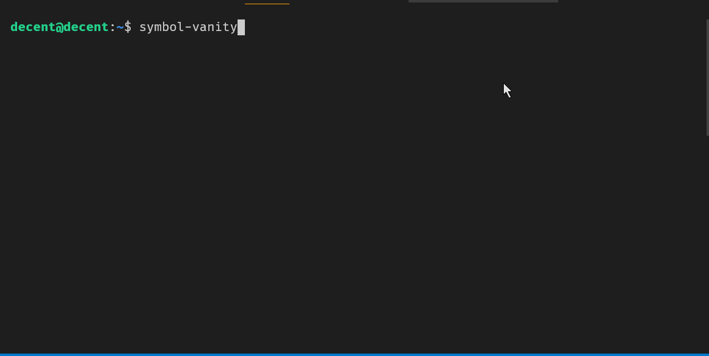

# symbol-vanity

## introduction
Symbol Vanity will try to generate addresses with the words of your choice.

## environment
node 12

## installation
`npm install -g symbol-vanity`

## usage
run `symbol-vanity` to see available commands \
Mnemonics that show in results can be imported in `symbol-desktop-wallet`!

# Concept of Vanity Type
As a word could be in any position in an address, I introduced a "Vanity Type" classification
### Left
The world starts at the first or second character of the address
#### examples:
word: `TOOL` \
address: **TOOL**CH-QVTCDN-42YROV-WLMAPB-LD55ZS-756IPJ-PB67 \
word: `COOL` \
address: T**COOL**C-QVTCDN-42YROV-WLMAPB-LD55ZS-756IPJ-PB67

### Right
The word is in the last characters of an address
#### example:
word: `SYMBOL` \
address: TOPDD-QVTCDN-42YROV-WLMAPB-LD55ZS-756I**SY-MBOL**

### Chunk number
The first letter of the word matches the first letter of a pretty address chunk

#### example of chunk 2:
word: `THIS` \
address: TOPDD-**THIS**I-AWESOM-EEOMEA-LD55ZS-756ISD-MDWE

#### example of chunk 3:
Searched word: `AWESOME`
address: TOPDD-TEWSI-**AWESOM-E**EOMEA-LD55ZS-756ISD-MDWE

### Free
Any word match that does not fit one of the above category
#### example:
word: `VANITY` \
address: TALBSJ-E7WK5S-QL5**VAN-ITY**GYG-RX67AZ-V7GZX2-M7TJ

# development
launch hot reload and enjoy! \
`npm run dev`
